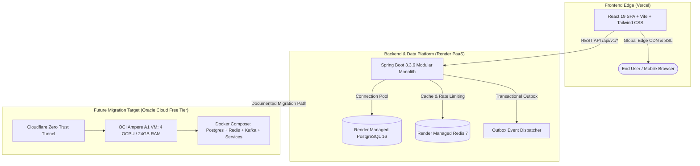

# FST Pay — AI-Powered Digital Wallet & Smart Virtual Card Platform

[](https://github.com/Burhan-21/FST_Pay/actions/workflows/backend.yml)
[](https://github.com/Burhan-21/FST_Pay/actions/workflows/frontend.yml)
[](#)
[](https://adoptium.net/)
[](https://spring.io/projects/spring-boot)
[](https://react.dev/)
[](https://www.typescriptlang.org/)
[](https://vercel.com)
[](https://render.com)

**FST Pay** (Fast · Secure · Trusted) is an enterprise-grade fintech platform engineered for teenagers (ages 12+), parents, and young adults. It pairs instant virtual prepaid cards and automated savings goals with an AI-driven financial mentor and parental supervision controls.

---

## 🏗 System Architecture



---

## ⚡ Tech Stack

| Tier | Technologies | Highlights |
|------|--------------|------------|
| **Frontend** | React 19, TypeScript, Vite, Tailwind CSS, TanStack Query, Framer Motion, Recharts | Glassmorphism, AMOLED theme, 3D card flip, 100% WCAG 2.1 AA |
| **Backend** | Java 17+, Spring Boot 3.3.6, Spring Security, Spring Data JPA, Lombok | Modular Monolith (14 domains), Interface Contracts, ArchUnit |
| **Messaging** | Transactional Outbox Pattern, Apache Kafka 3.7, Spring Domain Events | At-least-once delivery, optimistic concurrency, no dual-writes |
| **Data & Cache**| PostgreSQL 16 (Flyway migrations V1–V13), Redis 7 | Pessimistic locking for balance mutations, sliding session cache |
| **Security** | JWT (HMAC-SHA256), Bucket4j Rate Limiting, BCrypt, reCAPTCHA v2 | Strict startup validation, PAN masking, OWASP Top 10 hardened |
| **Observability**| Logstash JSON Encoder, OpenTelemetry Tracing, Prometheus Actuator | MDC correlation tracking (`X-Correlation-Id`), Grafana-ready |
| **Deployment** | **Vercel** (Frontend) + **Render** (Backend & DB) + **OCI** (Future Roadmap) | Multi-stage Docker layertools, K8s manifests, Cloudflare Tunnel |

---

## 📁 Repository Layout

```
FST_Pay/
├── backend/                  # Spring Boot 3.3.6 Java Application
│   ├── src/main/java/        # 14 Domain Modules & Shared Contracts
│   ├── src/main/resources/   # App Configuration & Flyway Migrations (db/migration)
│   ├── Dockerfile            # 3-Stage Multi-stage Distroless Layered Container
│   └── pom.xml               # Maven Project Configuration & Dependencies
├── frontend/                 # React 19 Single Page Application
│   ├── src/                  # Atomic Components, Features, Contexts, Hooks, Theme
│   ├── vercel.json           # Production Vercel Edge Configuration & Headers
│   ├── tailwind.config.js    # Design Tokens & Palette Definitions
│   └── package.json          # Frontend Dependencies & Scripts
├── deployment/               # Enterprise Deployment Hub
│   ├── vercel/               # Vercel Production Configuration & Deployment Guide
│   ├── render/               # Render Infrastructure-as-Code Blueprint (render.yaml)
│   ├── cloud/oracle/         # Oracle Cloud Always Free Migration Runbook & cloud-init
│   ├── kubernetes/           # Production K8s Manifests (StatefulSets, HPA, Ingress)
│   ├── docker/               # Production Docker Compose Configurations
│   └── nginx/                # Production Reverse Proxy Configuration
├── design/                   # UI/UX & Design System Specifications
│   ├── tokens.md             # CSS Variables, Brand Colors & Elevation Tokens
│   ├── react-components.md   # Atomic Hierarchy & Component Architecture
│   └── design-system.md      # WCAG 2.1 AA Standards & Responsive Guidelines
├── docs/                     # Centralized Technical Documentation
│   ├── prd.md                # Complete Product Requirements Document
│   ├── architecture.md       # Multi-Tier System Architecture & Diagrams
│   ├── memory.md             # Engineering Memory, Invariants & Technical Debt
│   ├── decisions.md          # Architecture Decision Records (ADRs) Master Register
│   ├── agents.md             # AI Agent Workflows, Guardrails & Maintenance Playbooks
│   └── archive/              # Historical Milestone Checklists & Sprint Summaries
├── scripts/                  # Automation & Operational Tooling (dev, ops, release)
├── docker-compose.yml        # Root Compose for Instant Local Full-Stack Bootstrapping
├── render.yaml               # Root Render Blueprint Specification
├── rules.md                  # Engineering & Coding Standards (SOLID, Commits, PRs)
├── testing.md                # Testing Protocols (Unit, ArchUnit, Testcontainers, E2E)
└── SECURITY.md               # Security Policy, Vulnerability Disclosure & OWASP Controls
```

---

## 🚀 Quick Start (Local Development)

### Prerequisites
- **Java 17+** & **Maven 3.9+**
- **Node.js 20+** & **npm 10+**
- **Docker Desktop**

### Option A: Local Native Development
```bash
# 1. Start Infrastructure (PostgreSQL 16 on 5434, Redis 7 on 6380)
docker compose up -d fstpay-postgres fstpay-redis

# 2. Start Backend (Spring Boot)
cd backend
mvn clean compile
mvn test                  # Run full test suite (76 tests + 12 ArchUnit checks)
mvn spring-boot:run       # Starts at http://localhost:8080

# 3. Start Frontend (React 19)
cd ../frontend
npm install
npm run test              # Run Vitest test suite (33 tests)
npm run dev               # Starts at http://localhost:5173
```

### Option B: Full Docker Compose
```bash
docker compose up --build
```
- Frontend: `http://localhost:80`
- Backend API: `http://localhost:8080/api/v1`
- Swagger UI: `http://localhost:8080/swagger-ui.html`
- Health Endpoint: `http://localhost:8080/actuator/health`

---

## 🌐 Production Deployment

### 1. Frontend on Vercel
Deploy the `frontend/` directory to **Vercel** with one click.
- Environment variables: `VITE_API_URL`, `VITE_RECAPTCHA_SITE_KEY`.
- See [`deployment/vercel/README.md`](deployment/vercel/README.md).

### 2. Backend on Render
Deploy using Render Blueprint (`render.yaml`).
- Auto-provisions PostgreSQL 16, Redis 7, and Docker Web Service with health probes.
- See [`deployment/render/README.md`](deployment/render/README.md).

### 3. Future Oracle Cloud Migration
When ready for zero-cost dedicated infrastructure:
- Follow the turn-key runbook in [`deployment/cloud/oracle/migration-guide.md`](deployment/cloud/oracle/migration-guide.md).

---

## 🧪 Testing & Verification

```bash
# Run Backend Tests
cd backend && mvn test

# Run Frontend Tests
cd ../frontend && npm run test

# Verify Frontend Production Build
npm run build
```

---

## 📚 Technical Documentation

- 📘 [Product Requirements Document (PRD)](docs/prd.md)
- 🏛 [System Architecture & Data Flows](docs/architecture.md)
- 🧠 [Project Memory & Technical Debt](docs/memory.md)
- 📋 [Architecture Decision Records (ADRs)](docs/decisions.md)
- 🤖 [AI Agent Workflows & Playbooks](docs/agents.md)
- 🎨 [Design Tokens & Design System](design/tokens.md)
- 📏 [Engineering Standards (rules.md)](rules.md)
- 🧪 [Testing Strategy (testing.md)](testing.md)
- 🔒 [Security Policy (SECURITY.md)](SECURITY.md)

---

## 📄 License
Proprietary & Confidential. All rights reserved. © 2026 FST Pay Engineering.
