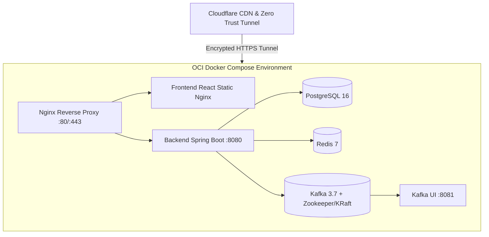

# Migration Runbook: Render & Vercel to Oracle Cloud Infrastructure (OCI)

This guide provides a turnkey migration blueprint for transitioning **FST Pay** from Render/Vercel to an **Oracle Cloud Infrastructure (OCI) Always Free** Ampere A1 instance.

---

## 1. Why Migrate to OCI?

- **Zero Monthly Cost**: Oracle's Always Free tier offers 4 ARM OCPUs, 24 GB RAM, and 200 GB NVMe storage permanently free.
- **Dedicated Resources**: Eliminates free-tier cold starts on Render and provides high performance for Spring Boot + PostgreSQL + Redis + Kafka.
- **Full Infrastructure Control**: Self-host Kafka event streaming, Prometheus/Grafana monitoring, and custom SSL termination with Cloudflare Tunnels.

---

## 2. Target Architecture on OCI



---

## 3. Pre-Migration Checklist

1. [ ] Create an Oracle Cloud Free Tier account at [cloud.oracle.com](https://cloud.oracle.com).
2. [ ] Create a Cloudflare account for DNS and Cloudflare Tunnel management.
3. [ ] Schedule a 15-minute maintenance window for final data sync.

---

## 4. Step-by-Step Migration Execution

### Step 1: Provision the VM with `cloud-init.yml`
1. In Oracle Cloud Console: Compute → Instances → **Create Instance**.
2. **Image**: Ubuntu 24.04 LTS (Minimal).
3. **Shape**: `VM.Standard.A1.Flex` (4 OCPU, 24 GB Memory).
4. **Boot Volume**: 200 GB.
5. **Advanced Options → Management**: Paste the contents of `deployment/cloud/oracle/cloud-init.yml` into User Data.
6. Launch instance and wait ~2 minutes.

### Step 2: Database Migration (Render → OCI)
Export data from Render PostgreSQL and restore to OCI PostgreSQL:

```bash
# 1. Take a snapshot from Render PostgreSQL
pg_dump -h <RENDER_PG_HOST> -U fstpay -d fstpay -F c -b -v -f fstpay_backup.dump

# 2. Transfer dump to OCI VM
scp -i ~/.ssh/oci_key fstpay_backup.dump ubuntu@<OCI_VM_IP>:/home/ubuntu/

# 3. Restore on OCI VM
docker compose -f deployment/cloud/oracle/docker-compose.prod.yml up -d fstpay-postgres
docker exec -i fstpay-postgres pg_restore -U fstpay -d fstpay -v /home/ubuntu/fstpay_backup.dump
```

### Step 3: Deploy Stack on OCI
```bash
cd /home/ubuntu/FST_Pay
# Configure production secrets in .env
cp .env.example .env
nano .env

# Launch entire production stack
docker compose -f deployment/cloud/oracle/docker-compose.prod.yml up -d --build
```

### Step 4: Configure Cloudflare Tunnel
1. In Cloudflare Zero Trust: Access → Tunnels → Create Tunnel.
2. Install the `cloudflared` connector on the OCI VM using the provided token.
3. Route public hostnames:
   - `pay.yourdomain.com` → `http://localhost:80` (Frontend)
   - `api.yourdomain.com` → `http://localhost:8080` (Backend API)

### Step 5: DNS Switch & Verification
1. Update DNS records to route traffic via Cloudflare.
2. Verify API health: `curl -I https://api.yourdomain.com/actuator/health`.
3. Verify frontend loading and live transactions.
4. Decommission Render and Vercel services once verification is complete.
