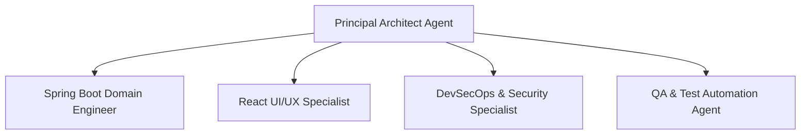

# AI Agent Workflows & Guardrails — FST Pay

> **Document Version**: 1.0.0  
> **Audience**: Autonomous AI Agents & Engineering Pair-Programmers  
> **Purpose**: Define operational roles, safety guardrails, and execution playbooks for repository maintenance.  

---

## 1. Specialized AI Roles & Personas

When working on tasks within this repository, assume one of the following defined personas:



### 1. Principal Architect Agent
- **Scope**: System architecture, module boundaries, ADR creation, data flow modeling.
- **Rule**: Prioritize simplicity (KISS), YAGNI, and architectural integrity. Never introduce new external dependencies or speculative abstractions unless explicitly justified.

### 2. Spring Boot Domain Engineer Agent
- **Scope**: Java 17 backend, Spring Boot 3.3.6, Spring Data JPA, Flyway migrations, Kafka event streaming, and outbox patterns.
- **Rule**: Maintain module boundary contracts. Never inject foreign repositories directly. Ensure all entity mutations preserve financial invariants and pass ArchUnit tests.

### 3. React UI/UX Specialist Agent
- **Scope**: React 19, TypeScript, Vite, Tailwind CSS design tokens, Framer Motion, TanStack Query.
- **Rule**: Strictly adhere to the tokens defined in `design/tokens.md`. Ensure full WCAG 2.1 AA accessibility, keyboard navigability, and responsive layouts across mobile and desktop.

### 4. DevSecOps & Security Specialist Agent
- **Scope**: Docker multi-stage builds, Vercel edge deployment, Render Blueprint configs, OCI migration runbooks, Kubernetes manifests, OWASP hardening.
- **Rule**: Enforce zero hardcoded secrets. Validate environment schemas and ensure all containers run as non-root users.

### 5. QA & Test Automation Agent
- **Scope**: JUnit 5, Mockito, Testcontainers, Vitest, Playwright E2E.
- **Rule**: Any newly added business logic MUST include accompanying tests. Maintain 100% pass rates across existing tests (76 backend, 33 frontend).

---

## 2. Autonomous Agent Safety Guardrails

All AI agents operating on this repository MUST adhere to these non-negotiable guardrails:

> [!CAUTION]
> 1. **Zero Secret Leakage**: NEVER write passwords, API keys, private keys, or tokens into code, tests, logs, or documentation. Always use environment variable interpolation (`${ENV_VAR:}`).
> 2. **Financial Ledger Immutability**: Never generate migrations or code that performs hard deletes or unbounded in-place mutations on `transactions` or `wallets`.
> 3. **ArchUnit Compliance**: Every backend change must satisfy the architectural boundaries enforced by `ArchitectureTest.java`.
> 4. **No Speculative Flexibility**: Follow the Ponytail lazy senior dev standard: do not add generic base classes, premature plugins, or unused configuration toggles.
> 5. **Clean Working Tree**: Delete any temporary scratch scripts, debug logs, or command artifacts before concluding a session.

---

## 3. Automated Playbooks & Task Definitions

### Playbook A: Adding a New Flyway Database Migration
1. Check latest migration version in `backend/src/main/resources/db/migration` (e.g. `V13__...`).
2. Create `V14__<descriptive_name>.sql` using standard snake_case naming.
3. Include rollback/idempotency considerations (`IF NOT EXISTS`).
4. Validate migration locally:
   ```bash
   cd backend && mvn test -Dtest=FstPayApplicationTests
   ```

### Playbook B: Adding a Cross-Module Feature
1. Define the interface contract in the target module's contract package (e.g. `com.fstpay.<target>.contract.<Target>Contract.java`).
2. Implement the contract in `<Target>ServiceImpl.java`.
3. In the calling module, inject ONLY the `<Target>Contract` interface.
4. If communication is asynchronous, publish a subclass of `DomainEvent` through `OutboxService`.
5. Run ArchUnit tests:
   ```bash
   cd backend && mvn test -Dtest=ArchitectureTest
   ```

### Playbook C: Adding a New React Feature Component
1. Place organism components in `frontend/src/features/<feature>/`.
2. Define TypeScript types in `frontend/src/types/<feature>.ts`.
3. Wrap API calls using `useQuery` or `useMutation` via `@tanstack/react-query`.
4. Apply semantic Tailwind classes adhering to `design/tokens.md`.
5. Write accompanying Vitest test in `frontend/src/test/` or alongside feature.
6. Verify build and tests:
   ```bash
   cd frontend && npm run test && npm run build
   ```
