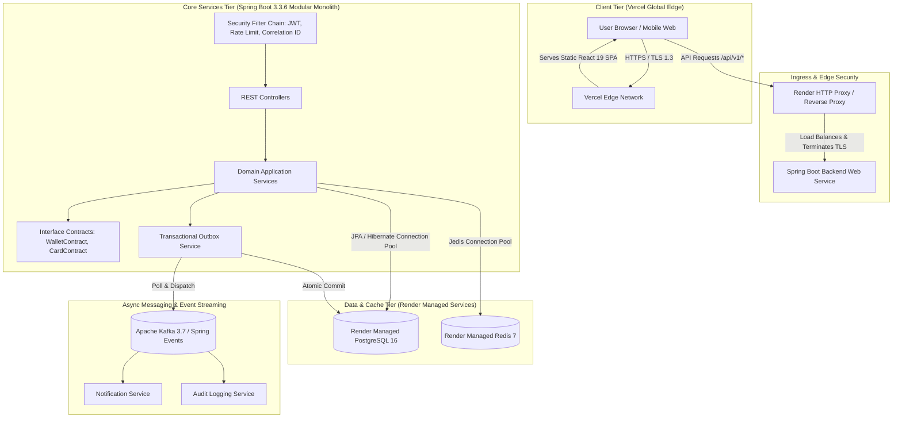
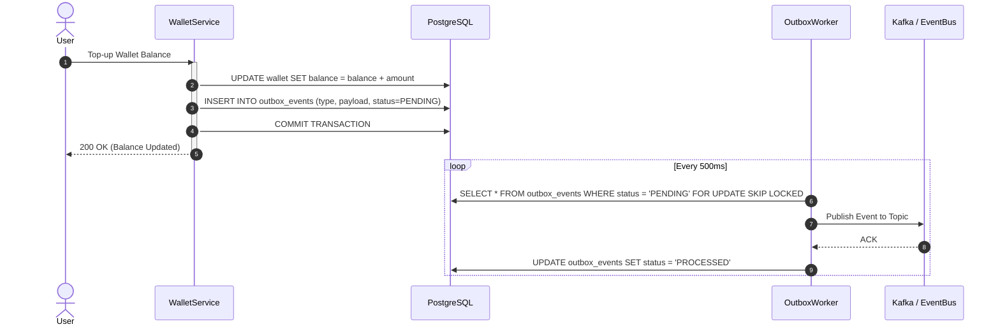

# System Architecture Specification — FST Pay

> **Author & Project Lead**: Shaikh Mohammed Burhan  
> **Document Version**: 2.0.0  
> **Architecture Pattern**: Modular Monolith + Event-Driven Transactional Outbox  
> **Target Deployment**: Vercel (Frontend) + Render PaaS (Backend & Data) + OCI Roadmap  

---

## 1. High-Level Enterprise Architecture



---

## 2. Frontend React 19 Architecture

The frontend is a high-performance Single Page Application (SPA) built with **React 19**, **TypeScript**, **Vite**, and **Tailwind CSS**.

### State Management Topology
1. **Server State**: Managed exclusively by `@tanstack/react-query`. Provides automated background re-fetching, request deduplication, cache invalidation, and optimistic mutations for fast UI updates.
2. **Global Client State**: Managed via lightweight React Contexts:
   - `AuthContext`: Holds current user profile, authentication state, and token refresh lifecycle.
   - `ThemeContext`: Controls Light, Dark, and AMOLED theme modes.
3. **Local State**: Component-level React `useState` and `useReducer`.

### Network & Interceptor Architecture
The Axios client in `frontend/src/api/` incorporates enterprise interceptors:
- **Request Interceptor**: Extracts JWT access token from memory/storage and appends `Authorization: Bearer <token>` and `X-Correlation-Id`.
- **Response Interceptor**: Intercepts `401 Unauthorized` responses, queues incoming requests, executes automated refresh token exchange via `/api/v1/auth/refresh`, and retries the original request with the fresh token.

---

## 3. Backend Modular Monolith Architecture

The backend is structured into 14 encapsulated domain modules under `com.fstpay.*`:

```
backend/src/main/java/com/fstpay/
├── admin/          # Admin reporting, user activation, system statistics
├── aicoach/        # AI Financial Coach (Gemini/OpenAI chat completions)
├── analytics/      # Spending breakdown & trend calculation
├── audit/          # Immutable security and compliance audit logging
├── auth/           # Registration, login, OTP generation, password reset
├── card/           # Virtual card lifecycle, PAN masking, spending limits
├── common/         # Cross-cutting exceptions, filters, DTOs, environment validation
├── goal/           # Savings goals, progress milestones, target completion
├── notification/   # In-app notifications & transactional email dispatch
├── parent/         # Parent-teen linking, allowance scheduler, supervision
├── report/         # Monthly PDF financial statements (OpenPDF)
├── reward/         # Gamification points, daily streaks, level progression
├── transaction/    # Purchase simulation, transfer ledger, fee calculations
├── user/           # User profile management, password updates
└── wallet/         # Core digital ledger, balance management, UPI top-ups
```

### Module Boundary Enforcement via Interface Contracts
To prevent circular dependencies and tangled spaghetti code, modules NEVER directly import or call repositories outside their bounded context. 
- Example: When `TransactionService` needs to deduct funds from a wallet, it calls `WalletContract.deductBalance(...)` instead of directly injecting `WalletRepository`.
- Architectural rules are verified during CI via **ArchUnit** tests in `ArchitectureTest.java`.

---

## 4. Transactional Outbox & Event Streaming

To achieve zero dual-write inconsistencies between database mutations and asynchronous events, FST Pay implements the **Transactional Outbox Pattern**:



---

## 5. Security & Authentication Architecture

1. **Defense in Depth**:
   - Edge security headers enforced at Vercel and Nginx layers.
   - Bucket4j rate limiting at the servlet filter level.
   - Spring Security Filter Chain enforcing stateless JWT validation.
2. **Token Security**:
   - Access tokens signed with HMAC-SHA256 (minimum 256-bit secret).
   - Refresh tokens stored in Redis with 7-day TTL and single-use rotation.
3. **Sensitive Data Protection**:
   - Card PANs are stored encrypted or hashed; only the last 4 digits are visible in general views.
   - Passwords hashed using BCrypt with work factor 12.

---

## 6. Observability & Telemetry

- **Correlation Tracking**: Every incoming request receives a UUID `correlationId` passed via `X-Correlation-Id` and bound to the SLF4J MDC.
- **Structured JSON Logging**: In production profiles, logs are output as single-line JSON objects with standard fields (`timestamp`, `level`, `service`, `traceId`, `spanId`, `correlationId`, `message`).
- **Distributed Tracing**: Native OpenTelemetry SDK instrumentation exporting spans to Jaeger / OTLP collectors.
- **Metrics**: Spring Boot Actuator with Micrometer exporting Prometheus metrics at `/actuator/prometheus`.
