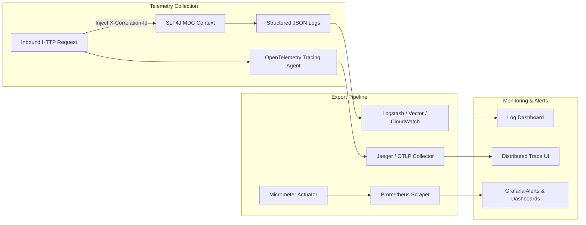

# Enterprise Production Hardening Specification — FST Pay

> **Document Version**: 2.0.0  
> **Status**: Approved Blueprint  
> **Target Environment**: Production (Vercel Edge + Render Backend + OCI Roadmap)  

---

## 1. Observability Pillar



### 1.1 Structured JSON Logging
Configured in `backend/src/main/resources/logback-spring.xml` for profile `prod`:
- Output is encoded via `net.logstash.logback.encoder.LoggingEventCompositeJsonEncoder`.
- Fields standard:
  ```json
  {
    "timestamp": "2026-09-13T14:15:30.123Z",
    "level": "INFO",
    "service": "fstpay",
    "thread": "http-nio-8080-exec-3",
    "logger": "com.fstpay.wallet.application.WalletService",
    "message": "Top-up completed for wallet: de1cfced-1214-4505-b2da-f15f24072057",
    "traceId": "4bf92f3577b34da6a3ce929d0e0e4736",
    "spanId": "00f067aa0ba902b7",
    "correlationId": "f81d4fae-7dec-11d0-a765-00a0c91e6bf6",
    "userId": "usr_99182312"
  }
  ```

### 1.2 OpenTelemetry Distributed Tracing
- Uses OpenTelemetry API (`io.opentelemetry:opentelemetry-api:1.39.0`) and OTLP Exporter.
- Injects standard W3C `traceparent` headers into outgoing Kafka messages and HTTP client calls.
- Traces database connection wait times, SQL query execution, and external AI completions.

### 1.3 Health Probes & Actuator Hardening
- Health probes enabled in `application.yml`:
  - Liveness: `/actuator/health/liveness` (validates basic process health).
  - Readiness: `/actuator/health/readiness` (validates PostgreSQL, Redis, and Kafka connectivity).
- Exposure restricted in production:
  - In `application-prod.yml`, `show-details: never` to prevent leaking internal database hostnames or stack versions to unauthorized probes.

---

## 2. Security & Compliance Pillar

### 2.1 OWASP Top 10 Mitigation Matrix

| Vulnerability Category | Risk | Implemented / Prescribed Defense |
|------------------------|------|-----------------------------------|
| **A01: Broken Access Control** | High | Spring Security method security (`@PreAuthorize("hasRole('ADMIN')")`), tenant ownership checks in service layers (`wallet.getUserId().equals(currentUser.getId())`). |
| **A02: Cryptographic Failures** | Critical | TLS 1.3, BCrypt password hashing (work factor 12), HMAC-SHA256 JWT keys (minimum 256-bit entropy), AES-256 for card PAN encryption. |
| **A03: Injection** | High | JPA Criteria and Parameterized queries (Hibernate) exclusively. Zero raw SQL string concatenation. Jakarta Validation on all DTOs. |
| **A04: Insecure Design** | Medium | Dual-token authentication, email OTP 2FA, daily and transaction-level spending limits, one-tap card freeze. |
| **A05: Security Misconfiguration** | Medium | Strict startup validator (`StartupEnvironmentValidator`) halts container on wildcard CORS or placeholder keys in `prod`. Non-root Docker containers. |
| **A06: Vulnerable Components** | Medium | Automated Dependabot scanning, multi-stage Docker build with zero build tools in runtime image. |
| **A07: Identification & Auth Failures** | High | Rate-limited OTP requests (1/minute), 5-attempt login lockout for 15 minutes, constant-time OTP string comparisons. |
| **A08: Software & Data Integrity** | High | Transactional Outbox pattern guarantees message integrity; Flyway migrations with SHA checksums prevent rogue schema tampering. |
| **A09: Logging & Monitoring Failures** | Medium | Append-only security audit log table (`audit_logs`), centralized JSON logging with correlation IDs. |
| **A10: SSRF** | Medium | Outgoing AI and email HTTP clients validate destination URLs against strict domain allowlists. |

### 2.2 Rate Limiting (Bucket4j)
- **Servlet Filter Level**: `RateLimitingFilter` intercepts requests before Spring MVC dispatch.
- **Tiers**:
  - `/api/v1/auth/*`: 10 requests / minute (Strict protection against brute-force).
  - `/api/v1/ai-coach/*`: 20 requests / minute (Controls LLM token consumption).
  - `/api/v1/*`: 150 requests / minute (General API protection).
- **Upgrade Path**: When scaling across multiple backend replicas on Render or OCI, replace in-memory caffeine cache with Redis-backed Bucket4j (`bucket4j-redis`).

---

## 3. CI/CD Automation Pillar

```mermaid
graph TD
    Push[Git Push / PR to master] --> Lint[Step 1: ESLint & Compile Check]
    Lint --> Test[Step 2: Automated Test Execution]
    Test -->|Backend| UnitTests[JUnit 5 & Mockito (76 Tests)]
    Test -->|Backend| ArchUnit[ArchUnit Boundary Verification]
    Test -->|Frontend| Vitest[Vitest UI Tests (33 Tests)]
    Test --> Scan[Step 3: Security & SAST Scanning]
    Scan --> CodeQL[GitHub CodeQL SAST]
    Scan --> Trivy[Trivy Vulnerability Scan]
    Scan --> Build[Step 4: Production Artifact Build]
    Build --> VercelDeploy[Deploy Frontend to Vercel]
    Build --> RenderDeploy[Deploy Backend to Render via Webhook]
```

### 3.1 Recommended Automated Security Workflows
1. **GitHub CodeQL Analysis**: Automatically scans Java and TypeScript code for injection flaws, path traversals, and insecure deserialization.
2. **Trivy Container Scan**: Scans base Alpine images and Maven dependencies for high/critical CVEs before container deployment.
3. **Automated Zero-Downtime Deployment**:
   - Vercel performs atomic deployments on git push.
   - Render pulls the Docker image, builds layers, performs health-checks on `/actuator/health/readiness`, and transitions traffic with zero dropped connections.

---

## 4. Resilience Pillar

### 4.1 Database Connection Pool (HikariCP) Tuning
Tuned in `backend/src/main/resources/application.yml`:
- `maximum-pool-size: 10` — Sized according to PostgreSQL formula: `((CPU cores * 2) + spindle_count)`.
- `minimum-idle: 5` — Maintains hot standby connections to minimize connection handshake latency.
- `connection-timeout: 20000ms` — Prevents threads from hanging indefinitely during spikes.
- `leak-detection-threshold: 5000ms` — Logs warnings if a transaction holds a database connection longer than 5 seconds.

### 4.2 Circuit Breakers & Retries (Resilience4j Pattern)
For external integrations (Google Gemini AI, Resend / SMTP email):
- **Failure Rate Threshold**: 50% failures over a 10-call sliding window opens the circuit.
- **Wait Duration in Open State**: 10 seconds before attempting half-open probe calls.
- **Exponential Backoff**: Transient network failures retry 3 times with exponential backoff (100ms, 200ms, 400ms) with randomized jitter.

### 4.3 Transactional Outbox Error Replay
- The `outbox_events` table includes `retry_count` and `error_message` columns.
- Failed event dispatches are automatically retried up to 5 times with exponential backoff.
- Exhausted events are moved to `DEAD_LETTER` status, generating an alert metric for operational investigation.
