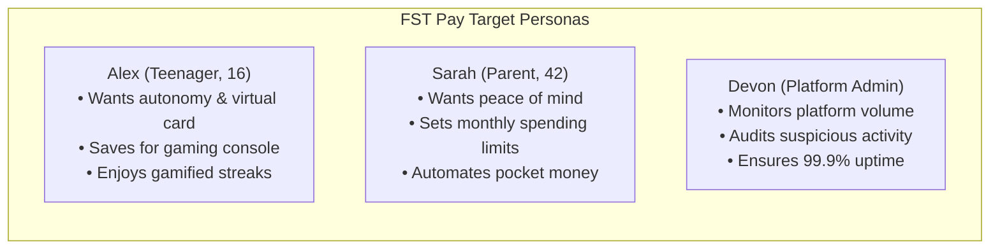

# Product Requirements Document (PRD) — FST Pay

> **Author & Project Lead**: Shaikh Mohammed Burhan  
> **Document Version**: 2.0.0  
> **Status**: Approved & Active  
> **Product Category**: Next-Gen AI-Powered Digital Wallet & Prepaid Card Platform  
> **Target Audience**: Teenagers (Ages 12–19), Parents/Guardians, Young Adults  

---

## 1. Executive Summary & Vision

**FST Pay** (Fast · Secure · Trusted) is a modern fintech platform engineered to bridge the gap between teen financial independence and parental oversight. By pairing virtual prepaid cards and automated savings goals with an AI-driven financial mentor and gamified rewards, FST Pay cultivates healthy financial habits in young users while providing parents with real-time visibility, smart limits, and automated allowances.

### Core Value Propositions
- **For Teens**: Instant virtual cards, seamless UPI wallet top-ups, gamified financial literacy, and an AI coach that teaches real-world budgeting.
- **For Parents**: Automated allowances, real-time transaction notifications, category-based spending rules, and one-tap emergency card freeze.
- **For Regulators & Partners**: PCI-DSS-aligned PAN masking, transactional outbox consistency, strict double-entry ledger principles, and OWASP-hardened endpoints.

---

## 2. Target Personas

### Persona 1: Teen User (Alex, 16)
- **Pain Points**: Relies on parents' credit cards; lacks visibility into personal spending; finds traditional banking apps confusing.
- **Goals**: Create custom virtual cards for online purchases, earn rewards for meeting savings goals, receive friendly guidance from the AI coach.

### Persona 2: Parent / Guardian (Sarah, 42)
- **Pain Points**: Worried about overspending or fraud; forgets weekly cash allowances; wants to teach financial literacy without micromanaging.
- **Goals**: Link to teen's account securely via email verification, set per-transaction or daily spending limits, review monthly expense breakdowns.

### Persona 3: Platform Administrator (Devon)
- **Pain Points**: Managing fraud alerts, detecting anomalous transaction volumes, maintaining audit trails.
- **Goals**: View real-time platform metrics, manage user states, audit security logs, verify Kafka dispatch health.

---

## 3. Core Functional Epics & Requirements

### Epic 1: Identity, Authentication & Security
- **REQ-AUTH-01 (Registration)**: Users register as `USER` (Teen) or `PARENT` with full name, email, phone, and password (enforcing minimum 8 characters, numbers, and symbols).
- **REQ-AUTH-02 (Two-Factor OTP Verification)**: Account registration and login require 6-digit cryptographic OTPs dispatched via transactional email, expiring in 10 minutes.
- **REQ-AUTH-03 (JWT Token Lifecycle)**: Dual-token system with short-lived access tokens (15 minutes) and long-lived refresh tokens (7 days) with sliding expiration.
- **REQ-AUTH-04 (Brute-Force Protection)**: Account lockout after 5 consecutive failed login attempts for 15 minutes.
- **REQ-AUTH-05 (Rate Limiting)**: IP and user-based request throttling via Bucket4j (10 requests/minute on auth endpoints, 150 requests/minute general).

### Epic 2: Digital Wallet & Ledger Architecture
- **REQ-WAL-01 (Ledger Consistency)**: Wallet balances are updated through transactional operations preventing negative balances (`SELECT FOR UPDATE` pessimistic row locking).
- **REQ-WAL-02 (Top-Up Channels)**: Instant top-ups via UPI simulation, bank transfer, and parent allowance transfers.
- **REQ-WAL-03 (Savings Goals)**: Users can create target-based savings sub-wallets with progress tracking and automatic goal completion events.

### Epic 3: Virtual Prepaid Cards
- **REQ-CARD-01 (Instant Card Issuance)**: Instant provisioning of 16-digit virtual cards with CVV, expiration date, and customizable visual skins.
- **REQ-CARD-02 (PAN Masking & PCI Compliance)**: Full 16-digit PAN and CVV are never transmitted unmasked in general payload responses; card displays require explicit user reveal actions.
- **REQ-CARD-03 (Lifecycle Controls)**: One-click card freeze/unfreeze and dynamic daily/monthly spending limit updates.

### Epic 4: Parent-Teen Financial Supervision
- **REQ-PAR-01 (Linking Protocol)**: Email-based mutual link verification between parent and teen accounts.
- **REQ-PAR-02 (Real-Time Spending Notifications)**: Parents receive instant notifications when teens initiate transactions exceeding configured thresholds.
- **REQ-PAR-03 (Automated Allowance)**: Scheduled recurrent wallet transfers from parent wallet to linked teen wallets.

### Epic 5: AI Financial Coach
- **REQ-AI-01 (Context-Aware Coaching)**: Integration with Google Gemini / OpenAI API to provide customized financial tips based on user's recent spending categories.
- **REQ-AI-02 (Guardrails)**: Prompt guardrails preventing generic stock investment advice or unauthorized financial claims.

### Epic 6: Gamification, Streaks & Rewards
- **REQ-REW-01 (Streak Tracking)**: Daily login and budget adherence streaks with multipliers.
- **REQ-REW-02 (XP & Level Progression)**: Experience points awarded for completing savings goals and financial quizzes.
- **REQ-REW-03 (Catalog Redemption)**: In-app store to redeem points for partner vouchers and custom card visual themes.

### Epic 7: Analytics & Reporting
- **REQ-ANA-01 (Category Breakdown)**: Interactive spending visualizer (Recharts) categorized into Food, Entertainment, Shopping, Education, and Utilities.
- **REQ-ANA-02 (PDF Statement Generation)**: Dynamic generation of monthly statements with OpenPDF formatted for auditability.

---

## 4. Non-Functional Requirements (NFRs)

| Domain | Specification | Target Metric |
|--------|---------------|---------------|
| **Latency** | REST API p95 response time | `< 200ms` |
| **Availability** | Production service uptime | `99.9%` |
| **Security** | OWASP Top 10 compliance & TLS encryption | `A+ Rating (SSL Labs)` |
| **Data Integrity** | Transactional ledger consistency | `Zero phantom transactions` |
| **Mobile UX** | Touch-friendly responsive design | `100% WCAG 2.1 AA compliant` |
| **Concurrency** | Simultaneous active users | `10,000+ concurrent sessions` |
