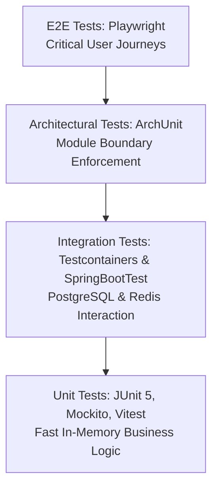

# Testing Strategy & Protocols — FST Pay

> **Document Version**: 2.0.0  
> **Target Quality Standard**: Zero-Defect Financial Core  
> **CI Integration**: Automated execution on every push and pull request.  

---

## 1. Testing Pyramid Overview

FST Pay enforces a multi-tier testing strategy ensuring fast developer feedback, high confidence in financial mutations, and architectural boundary integrity.



| Tier | Technology | Target Scope | Execution Time | Coverage Target |
|------|------------|--------------|----------------|-----------------|
| **Unit (Backend)** | JUnit 5 + Mockito | Domain services, entity logic, validators | `< 10s` | `≥ 80%` |
| **Unit (Frontend)** | Vitest + RTL | UI components, custom hooks, reducers | `< 5s` | `≥ 75%` |
| **Architectural** | ArchUnit 1.3 | Module isolation, circular dependency checks | `< 8s` | `100% rules` |
| **Integration** | Testcontainers + H2 | DB queries, repository contracts, Redis cache | `< 30s` | Critical flows |
| **End-to-End (E2E)** | Playwright | Registration, login, card flip, top-up | `< 2m` | Top 5 flows |

---

## 2. Backend Testing Protocols

### 2.1 Unit Tests (JUnit 5 & Mockito)
- **Focus**: Service business logic without bootstrapping Spring context.
- **Convention**: Test classes named `<ClassUnderTest>Test.java`, placed in parallel test package under `backend/src/test/java/`.
- **Assertion**: Use AssertJ (`assertThat(...)`) for fluent, readable assertions.
- **Mocking**: Use `@ExtendWith(MockitoExtension.class)` and `@Mock` / `@InjectMocks`.

### 2.2 Architectural Tests (ArchUnit)
Enforced in `com.fstpay.architecture.ArchitectureTest`:
1. **Module Isolation**: `moduleA` classes cannot access `moduleB` internal classes.
2. **Layering Rules**: Controllers cannot bypass services to talk directly to repositories.
3. **Naming Rules**: Exception classes must end with `Exception`; Repository interfaces must end with `Repository`.
4. **Spring Injection**: Fields must not be annotated with `@Autowired` (enforces constructor injection).

### 2.3 Integration Tests (Spring Boot Test & Testcontainers)
- Use `@SpringBootTest` with `@ActiveProfiles("test")`.
- Testcontainers spins up lightweight Docker instances of PostgreSQL 16 and Redis 7 to test real dialect queries and database constraints without polluting developer environments.

---

## 3. Frontend Testing Protocols

### 3.1 Unit & Component Tests (Vitest)
- Test files located in `frontend/src/test/` or adjacent `<Component>.test.tsx`.
- Built on Vitest for instantaneous HMR test execution:
  ```bash
  cd frontend
  npm run test            # Single run
  npm run test:watch      # Interactive TDD watch mode
  npm run test:coverage   # Generate Istanbul/v8 coverage report
  ```

### 3.2 End-to-End (E2E) Testing (Playwright)
- Located in `frontend/tests/`.
- Tests simulated user journeys:
  - User signs up, enters mock OTP, and reaches dashboard.
  - User tops up wallet and sees balance increase immediately.
  - User generates a virtual card and toggles card freeze state.

---

## 4. Quality Thresholds & Gating

The CI build will **fail immediately** if:
1. Any test in the suite fails.
2. An ArchUnit architectural rule is violated.
3. Code coverage on core financial packages (`com.fstpay.wallet.*`, `com.fstpay.transaction.*`) drops below **80%**.
4. TypeScript compilation produces any error (`tsc -b`).

---

## 5. Quick Verification Commands

```powershell
# 1. Run full backend test suite (76 tests + 12 ArchUnit checks)
cd backend
mvn test

# 2. Run full frontend test suite (33 tests)
cd ../frontend
npm run test

# 3. Verify frontend production compilation
npm run build
```
